# Fellow

**Fellow** is a developer-networking platform — think "swipe to connect" for developers. Users create a profile, browse a feed of other developers, send connection requests, and chat in real time once connected.

> Product tagline: *Grow your dev network. Ship together.*

## Features

- **Auth** — signup / login / logout via JWT stored in an httpOnly cookie
- **Profile** — view and edit your profile (name, age, gender, about, skills, photo)
- **Feed** — browse developers you haven't interacted with yet
- **Connection requests** — send `interested` / `ignored`, review incoming requests as `accepted` / `rejected`
- **Connections** — list of mutually accepted connections
- **Real-time chat** — 1:1 messaging over Socket.IO, persisted to MongoDB
- **Protected routes** — session-gated pages on the frontend

> Premium membership / Razorpay payments and email notifications exist in the codebase but are not currently functional end-to-end, so they're left out of the sections below.

## Tech Stack

**Frontend** — React 19, Vite, React Router DOM v7, Tailwind CSS v4, Axios, Socket.IO client
**Backend** — Node.js, Express 5, MongoDB + Mongoose, Socket.IO, JWT, bcrypt

## Architecture

```mermaid
flowchart LR
    subgraph Client["Frontend (React + Vite, Vercel)"]
        UI["Pages: Landing, Login, Signup,\nFeed, Requests, ChatLayout,\nProfile"]
        Axios["Axios (withCredentials)"]
        SocketClient["Socket.IO client"]
    end

    subgraph Server["Backend (Express 5, Render)"]
        Routes["Routers\n/signup /login /logout\n/profile /feed\n/request /user/*"]
        Auth["userAuth middleware\n(JWT via httpOnly cookie)"]
        SocketServer["Socket.IO server\njoinChat / sendMessage"]
    end

    DB[(MongoDB\nUsers, ConnectionRequests, Chats)]

    UI --> Axios
    UI --> SocketClient
    Axios -- "HTTPS + cookie" --> Routes
    SocketClient -- "WebSocket" --> SocketServer
    Routes --> Auth
    Auth --> Routes
    Routes --> DB
    SocketServer --> DB
```



### Request flow

1. Frontend calls the backend with Axios using `withCredentials: true` so the `token` cookie is sent.
2. `userAuth` middleware verifies the JWT from the cookie and attaches `req.user`.
3. Route handlers read/write MongoDB via Mongoose models.
4. Chat messages additionally flow over a Socket.IO connection, joined to a deterministic per-pair room and persisted to the `Chat` collection.

## API Endpoints

| Method | Path | Auth | Description |
|---|---|---|---|
| POST | `/signup` | — | Create an account |
| POST | `/login` | — | Log in, sets auth cookie |
| POST | `/logout` | — | Clear auth cookie |
| GET | `/profile/view` | ✅ | Get current user's profile |
| PATCH | `/profile/edit` | ✅ | Update current user's profile |
| GET | `/feed` | ✅ | Get feed of unconnected users |
| POST | `/request/send/:status/:toUserId` | ✅ | Send a connection request (`interested` \| `ignored`) |
| POST | `/request/review/:status/:requestId` | ✅ | Review a received request (`accepted` \| `rejected`) |
| GET | `/user/requests/received` | ✅ | List pending incoming requests |
| GET | `/user/connections` | ✅ | List accepted connections |
| GET | `/chat/:targetUserId` | ✅ | Get (or create) a chat with a user |

**Socket.IO events:** `joinChat`, `sendMessage` → `messageReceived`

## Data Models

- **User** — firstName, lastName, emailId, password (hashed), age, gender, isPremium, photoUrl, about, skills
- **ConnectionRequest** — fromUserId, toUserId, status (`ignored` \| `interested` \| `accepted` \| `rejected`)
- **Chat** — participants, messages (senderId, text, timestamp)

## Project Structure

```
fellow/
├── backend/
│   └── src/
│       ├── app.js              # entry point
│       ├── config/database.js  # Mongo connection
│       ├── middlewares/auth.js # userAuth (JWT)
│       ├── models/             # User, ConnectionRequest, Chat, Payment
│       ├── routes/             # auth, profile, feed, request, user, chat, payment
│       └── utils/socket.js     # Socket.IO server
└── frontend/
    └── src/
        ├── App.jsx             # router config
        └── components/         # Landing, Login, Signup, Feed, Requests,
                                 # ChatLayout, Profile, Navbar, ProtectedRoute, NotFound
```

## Getting Started

### Prerequisites

- Node.js
- A MongoDB connection string (e.g. MongoDB Atlas)

### Backend

```bash
cd backend
npm install
```

Create a `.env` file in `backend/`:

```
DB_CONNECTION_SECRET=<your MongoDB connection string>
PORT=7777
JWT_SECRET=<your JWT secret>
FRONTEND_URL=http://localhost:5173
```

```bash
npm start
```

### Frontend

```bash
cd frontend
npm install
```

Create a `.env` file in `frontend/`:

```
VITE_SOCKET_URL=http://localhost:7777
```

```bash
npm run dev
```

The frontend runs on Vite's default port (`5173`) and talks to the backend at `VITE_SOCKET_URL` (used for both REST calls and the Socket.IO connection).

## Deployment

- **Frontend** — Vercel (SPA rewrites configured in `frontend/vercel.json`)
- **Backend** — Render
